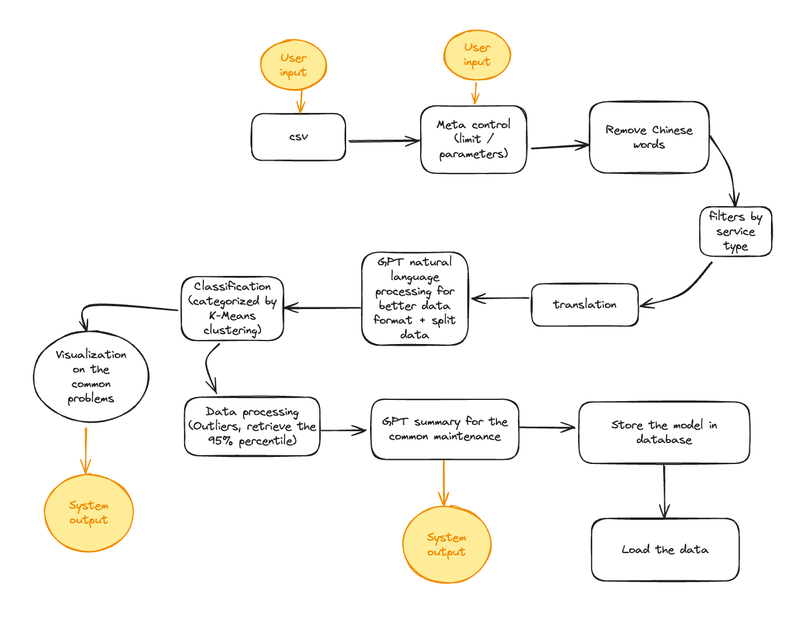

# Data Analysis for EAM system

## Flow Chart



## Description

This project aims to harness the power of local language model to automate the process of data analysis for large amount of dataset.

## Features

- Feature 1: Easy UI Navigation
- Feature 2: Analysis History
- Feature 3: GPT Generated Summary

## Installation

To install this project, follow these steps:

#### Dependencies
1. Step 1: Install [Ollama](https://ollama.com/download/windows)
2. Step 2: run ollama pull phi3 llama3.1 (depends on GPU configuration)
3. Step 3: Install [Python](https://www.python.org/downloads/) (Ideally python 3.10)
4. Step 4: Clone the GitHub Repository https://github.com/bestfranklinAI/EAM-System
5. Step 5: python -m venv EAM
6. Step 6: EAM\Scripts\activate
7. Step 7: pip install -r requirements.txt
8. Step 8: Verify Configuration (python --version pip list)


##### For Step 4 - 7, feel free to paste the following code to the working folder directory **FOR THE FIRST TIME** (only need to do ONCE) *(For window)*

```powershell
# Step 4: Create a virtual environment
python -m venv EAM
```

```powershell
# Step 5: Activate the virtual environment
powershell -noexit -ExecutionPolicy Bypass -File ./EAM/Scripts/Activate.ps1
```

```powershell
./initial.ps1
```


## Usage

To use this project, follow these steps:

1. Step 1: Run "app.py"
2. Step 2: Browse http://127.0.0.1:5000
3. Step 3: Upload the file in CSV format
4. Step 4: Navigate to analysis page
5. Step 5: View the summary and category in history page

##### For Step 1-2, feel free to copy the following every time you want to start to program. *(For window)*
```powershell
#Activate the virtual environment
powershell -noexit -ExecutionPolicy Bypass -File ./EAM/Scripts/Activate.ps1
```

```powershell
# Step 1: Run app.py using the virtual environment's Python interpreter
./start.ps1
```

## Contributing

Contributions are welcome! Please follow these guidelines:

- Guidelines 1: Clone the git repository
- Guidelines 2: Checkout to a branch
- Guidelines 3: Post a push request

## Contributor
- Franklin Cheung (franklin123ann@gmail.com)

## License

This project is licensed under the [MIT License](LICENSE).
